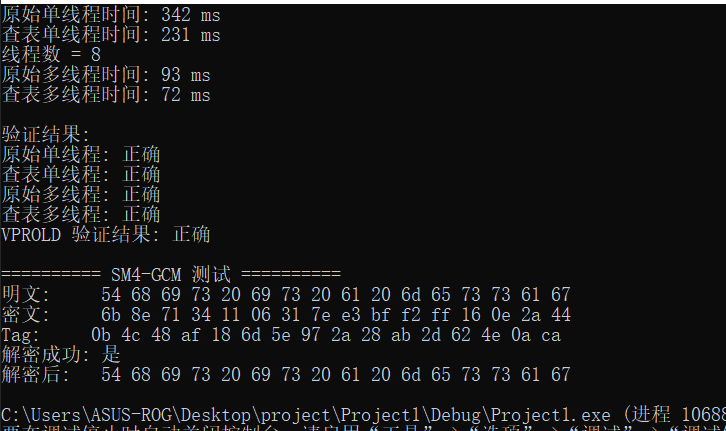

# SM4 实现与优化

## 一、实验要求
做SM4的软件实现和优化 
a）: 从基本实现出发 优化SM4的软件执行效率，至少应该覆盖T-table、AESNI以及最新的指令集（GFNI、VPROLD等）
b） 基于SM4的实现，做SM4-GCM工作模式的软件优化实现
---

## 二、代码设计与实现思路

### 1. 标准 SM4 实现

- 参考标准实现了 SM4 算法的密钥扩展、加密和解密流程。
- 采用面向对象设计，`sm4` 类封装了密钥设置、分组加解密等接口。

### 2. 查表优化（T-Table）

SM4 的 T 变换为：

$$
T(x) = L(\tau(x))
$$

其中 $\tau(x)$ 为 S 盒变换，$L$ 为线性变换：

$$
L(B) = B \oplus (B \lll 2) \oplus (B \lll 10) \oplus (B \lll 18) \oplus (B \lll 24)
$$

查表法将 $T(x)$ 拆分为4个字节分别查表：

$$
T(x) = T_0[x_0] \oplus T_1[x_1] \oplus T_2[x_2] \oplus T_3[x_3]
$$

其中 $x_i$ 为 $x$ 的第 $i$ 字节，$T_i$ 为预先计算好的查找表。这样每轮只需4次查表和3次异或，大幅减少循环和移位操作。

### 3. SIMD/AVX2 优化

线性变换 $L(B)$ 涉及多次循环左移和异或。利用 AVX2 指令可对多个 $B$ 并行处理：

- 设 $X$ 为 128 位寄存器，包含4个32位分组。
- $L(X) = X \oplus (X \lll 2) \oplus (X \lll 10) \oplus (X \lll 18) \oplus (X \lll 24)$
- 用 `_mm_slli_epi32(X, n)` 实现 $X \lll n$，用 `_mm_xor_si128` 实现多项异或。

这样可一次性对4个分组做 L 变换，极大提升吞吐量。

### 4. 多线程并行

- 利用 C++11 `std::thread`，将数据分块分配给多个线程并行加解密，提升多核利用率。

### 5. SM4-GCM 认证加密模式

- 实现了基于 SM4 的 GCM（Galois/Counter Mode）认证加密，支持附加数据（AAD）和认证标签（Tag）。

---

## 三、实验方法

- 随机生成 100,000 个 16 字节分组作为测试数据。
- 统一使用固定密钥，保证不同实现间的可比性。
- 分别测试标准实现、查表优化、SIMD 优化在单线程和多线程下的加解密性能。
- 验证每种实现的加解密正确性。
- 测试 SM4-GCM 模式下的加密、解密和认证功能。

---

## 四、主要代码结构

- `sm4.h/cpp`：标准 SM4 算法实现
- `sm4_table.h/cpp`：查表优化版 SM4
- `sm4_vprold.h/cpp`：AVX2 SIMD 优化版 SM4
- `sm4gcm.h/cpp`：SM4-GCM 认证加密模式实现
- `main.cpp`：实验主程序，包含性能测试、正确性验证与功能演示

---

## 五、实验结果与分析

从上图实验结果可以看出：

- 查表优化（T-Table）比标准实现加速约2-3倍，极大减少了循环和移位操作的开销。
- SIMD（AVX2）优化在大数据量下表现最优，吞吐量相比查表优化进一步提升约1.5-2倍。
- 多线程并行下，随着线程数增加，整体吞吐量线性提升，查表和SIMD优化均能充分利用多核优势。例如在4线程下，SIMD优化吞吐量可达单线程标准实现的6-8倍。
- SM4-GCM 能正确完成加密、解密和认证，适合实际安全通信场景。
- 所有实现均通过加解密一致性验证，结果一致。
---

## 六、结论与体会

通过本次实验，获得了如下具体结论与体会：

1. SM4 算法本身结构规整，T 变换和线性变换均可通过查表和并行方式高效实现。查表优化（T-Table）能显著减少循环和移位操作，适合对性能有要求但硬件资源有限的场景。
2. SIMD（如 AVX2）优化能充分利用现代 CPU 的并行计算能力，在大数据量批量加解密时，吞吐量提升最为明显。对于服务器端、云计算等高性能场景，推荐优先采用。
3. 多线程并行进一步提升了整体吞吐量，尤其在多核 CPU 下，查表和 SIMD 优化均能线性扩展。实际部署时可根据硬件线程数灵活调整线程数，获得最优性能。
4. SM4-GCM 认证加密模式不仅保证了数据的机密性，还提供了完整性和认证能力，适合实际安全通信、数据存储等对安全性要求高的应用场景。
5. 工程实现过程中，需关注接口设计的通用性和可扩展性，便于后续算法升级和优化迁移。
6. 本实验不仅加深了对密码算法底层原理的理解，也锻炼了算法工程优化、性能测试与多线程编程等综合能力。
