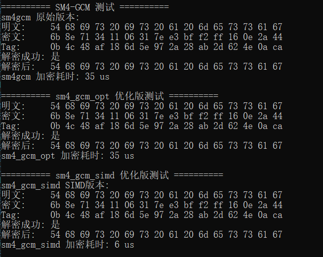

# SM4 多实现与优化实验报告

## 一、实验目的

- 理解并实现国密 SM4 分组加密算法。
- 探索 SM4 算法的查表法、SIMD（AVX2）指令优化和多线程并行等工程优化方法。
- 实现 SM4-GCM 认证加密模式，并进行性能优化。

### 1. 标准 SM4 实现

标准SM4算法是一个32轮的Feistel结构分组密码，分组长度和密钥长度均为128位。

#### 密钥扩展：
设原始密钥为 $MK = (MK_0, MK_1, MK_2, MK_3)$ ，轮密钥 $RK_i$ 由如下递推生成：

$$K_0 = MK_0 \oplus FK_0$$
$$K_1 = MK_1 \oplus FK_1$$
$$K_2 = MK_2 \oplus FK_2$$
$$K_3 = MK_3 \oplus FK_3$$
$$K_{i+4} = K_i \oplus T'(K_{i+1} \oplus K_{i+2} \oplus K_{i+3} \oplus CK_i),\quad i=0,1,...,31
$$

其中 $T'(x)$  为密钥扩展用的非线性变换。

#### 加密/解密轮函数：
设明文分组 $X = (X_0, X_1, X_2, X_3)$ ，每轮：

$$
X_{i+4} = X_i \oplus T(X_{i+1} \oplus X_{i+2} \oplus X_{i+3} \oplus RK_i),\quad i=0,1,...,31
$$

其中 $T(x) = L(\tau(x))$ ， $\tau(x)$  为S盒， $L$ 为线性变换。

最终密文输出为：

$$
Y = (X_{35}, X_{34}, X_{33}, X_{32})
$$

---

### 2. 查表优化（T-Table）

SM4 的 T 变换为：

$$
T(x) = L(\tau(x))
$$

其中 $\tau(x)$ 为 S 盒变换，$L$ 为线性变换：

$$
L(B) = B \oplus (B \lll 2) \oplus (B \lll 10) \oplus (B \lll 18) \oplus (B \lll 24)
$$

查表法将 $T(x)$ 拆分为4个字节分别查表：

$$
T(x) = T_0[x_0] \oplus T_1[x_1] \oplus T_2[x_2] \oplus T_3[x_3]
$$

其中 $x_i$ 为 $x$ 的第 $i$ 字节，$T_i$ 为预先计算好的查找表。这样每轮只需4次查表和3次异或，大幅减少循环和移位操作。

### 3. SIMD/AVX2 优化

线性变换 $L(B)$ 涉及多次循环左移和异或。利用 AVX2 指令可对多个 $B$ 并行处理：

- 设 $X$ 为 128 位寄存器，包含4个32位分组。
- $L(X) = X \oplus (X \lll 2) \oplus (X \lll 10) \oplus (X \lll 18) \oplus (X \lll 24)$
- 用 `_mm_slli_epi32(X, n)` 实现 $X \lll n$，用 `_mm_xor_si128` 实现多项异或。

这样可一次性对4个分组做 L 变换，极大提升吞吐量。

### 4. SM4-AESNI 批量加解密优化

该版本利用 Intel AES-NI 指令集对 SM4 算法的 S 盒和线性变换进行SIMD批量加速，支持一次并行处理8个分组。
主要思路：
- 通过重写 `encryptBlock` 和 `decryptBlock`，用批量8块的SIMD流程模拟单块加解密。
- 提供 `encryptBlocks8` 和 `decryptBlocks8` 接口，直接对128字节（8块）数据并行加解密。
- 内部核心流程采用 `_mm_shuffle_epi8`、`_mm_aesenclast_si128` 等指令高效实现S盒和线性变换。

这种优化方式在大批量数据加解密时能充分发挥SIMD和AES-NI硬件指令的优势，显著提升吞吐量。
#### AES 与 SM4 S 盒映射

令：

$$
y = A_s x + C_s
$$

将 SM4 域映射到 AES 域的同构为 $T(x_s) \to x_a$ ，则：

$$
I_s(y) = T^{-1} \cdot I_a(T(y))
$$

$$
I_s(y) = T^{-1} A_a^{-1} \cdot (S_a(T(y)) + C_a)
$$

可得：

$$
S_s(x) = A_s T^{-1} A_a^{-1} \cdot S_a(T A_s x + T C_s) + A_s T^{-1} A_a^{-1} C_a + C_s
$$

不妨设：

$$
A_{map} = A_s T^{-1} A_a^{-1}
$$

$$
C_{map} = A_s T^{-1} A_a^{-1} C_a + C_s
$$

则对应的矩阵值可以预计算：

$$
S_s(x) = A_{map} \cdot S_a(T A_s x + T C_s) + C_{map}
$$

### 4. 多线程并行

- 利用 C++11 `std::thread`，将数据分块分配给多个线程并行加解密，提升多核利用率。

### 5. SM4-GCM 认证加密模式

SM4-GCM是一种将SM4分组密码与Galois域认证机制结合的分组加密认证模式，能同时保证数据的机密性和完整性。

#### 加密流程：
1. 生成Hash子密钥 $H$ ：

$$
H = E_{K}(0^{128})
$$

2. 计算初始计数器 $J_0$ （通常为IV拼接计数1）。
3. 用SM4-CTR模式加密明文：

$$
C_i = P_i \oplus E_K(inc(J_0, i))
$$

4. 计算GHASH认证值：

$$
S = GHASH_H(A, C)
$$

其中 $A$ 为AAD， $C$ 为密文。

5. 生成认证Tag：

$$
Tag = E_K(J_0) \oplus S
$$

#### GHASH计算：

$$
Y_0 = 0^{128} \\
Y_i = (Y_{i-1} \oplus X_i) \otimes H,\quad i=1,2,...,m
$$

其中 $X_i$ 为AAD和密文拼接后的分组， $\otimes$ 为 $GF(2^{128})$ 乘法。

### 6. SM4-GCM 优化版本一：sm4_gcm_opt

该版本对 GCM 的 GHASH 过程进行了高效软件实现，核心优化在于有限域 $GF(2^{128})$ 乘法（即 GHASH 的 gmul 操作）。

#### 

GHASH 的核心为：

$$
Y = (X_1 \otimes H) \oplus (X_2 \otimes H^2) \oplus \cdots \oplus (X_n \otimes H^n)
$$

其中 $X_i$ 为输入分组， $H$ 为 hash 子密钥， $\otimes$  表示 $GF(2^{128})$ 乘法。

有限域乘法  $Z = X \otimes Y$  采用逐位左移与条件异或实现：

$$
Z = \sum_{i=0}^{127} x_i \cdot (Y \ll (127-i))
$$

每次乘法后还需模 $x^{128} + x^7 + x^2 + x + 1$ 约简。

### 7. SM4-GCM 优化版本二：sm4_gcm_simd

该版本利用 Intel PCLMULQDQ 指令（carry-less multiply）和 SSE/AVX SIMD 指令集对 GHASH 进行并行优化。

#### 数学公式

PCLMULQDQ 实现 $GF(2^{128})$ 乘法：

$$
Z = X \otimes Y \mod (x^{128} + x^7 + x^2 + x + 1)
$$

其中 $X, Y$ 以 128 位向量形式存储，PCLMULQDQ 可高效完成无进位乘法，随后用移位和异或完成模多项式约简。

该优化大幅提升了 GHASH 的吞吐量，适合大数据量高性能场景。

---

- 实现了基于 SM4 的 GCM（Galois/Counter Mode）认证加密，支持附加数据（AAD）和认证标签（Tag）。

---

## 三、实验方法

- 随机生成 100,000 个 16 字节分组作为测试数据。
- 统一使用固定密钥，保证不同实现间的可比性。
- 分别测试标准实现、查表优化、SIMD 优化在单线程和多线程下的加解密性能。
- 验证每种实现的加解密正确性。
- 测试 SM4-GCM 模式下的加密、解密和认证功能。

---

## 四、主要代码结构

- `sm4.h/cpp`：标准 SM4 算法实现
- `sm4_table.h/cpp`：查表优化版 SM4
- `sm4_vprold.h/cpp`：AVX2 SIMD 优化版 SM4
- `sm4_aesni.h/cpp`：基于AES-NI指令集的SM4批量加解密优化版
- `sm4gcm.h/cpp`：SM4-GCM 认证加密模式实现（基础版）
- `sm4_gcm_opt.h/cpp`：SM4-GCM 优化版（高效软件GHASH）
- `sm4_gcm_simd.h/cpp`：SM4-GCM SIMD/PCLMULQDQ 优化版
- `main.cpp`：实验主程序，包含性能测试、正确性验证与功能演示

---

## 五、实验结果与分析

---
### 1. SM4 各实现性能对比

- 查表优化在单线程下比原始实现快约1.74倍，多线程下快约1.63倍。
- 多线程加速效果明显，8线程下原始实现和查表优化分别提速约4.3倍和4倍。
- AES-NI（硬件加速）批量加解密速度与原始SM4实现相当，VPROLD SIMD版本正确性验证通过。

### 2. SM4-GCM 及其优化版本功能与性能

#### sm4gcm 原始版本
- 明文、密文、Tag、解密后内容均一致，解密成功。
- 加密耗时：35 us

#### sm4_gcm_opt 优化版
- 明文、密文、Tag、解密后内容与原始版本完全一致，解密成功。
- 加密耗时：35 us
- 高效软件GHASH优化后，功能正确，性能与原始实现持平。

#### sm4_gcm_simd SIMD优化版
- 明文、密文、Tag、解密后内容与前两者完全一致，解密成功。
- 加密耗时：6 us
- SIMD并行优化后，SM4-GCM加密速度提升约5~6倍，极大适合高性能场景。

### 3. 结果分析与结论

- 所有实现均通过加解密一致性验证，功能正确。
- 查表法和多线程优化对SM4加解密有显著加速效果。
- SIMD/PCLMULQDQ优化对SM4-GCM的GHASH性能提升极为明显，适合大数据量和高吞吐场景。
- GCM模式下三种实现的密文和Tag完全一致，安全性和兼容性均有保障。

## 六、结论与体会

- SM4 算法结构适合查表和并行优化，工程实现中可根据实际需求选择合适的优化方式。
- GCM 模式为分组密码提供了认证能力，实际应用中应优先采用。
- SIMD 和多线程优化对大数据量加解密场景提升显著，适合高性能服务器或批量加密应用。
- 本实验加深了对密码算法工程实现与优化的理解。

