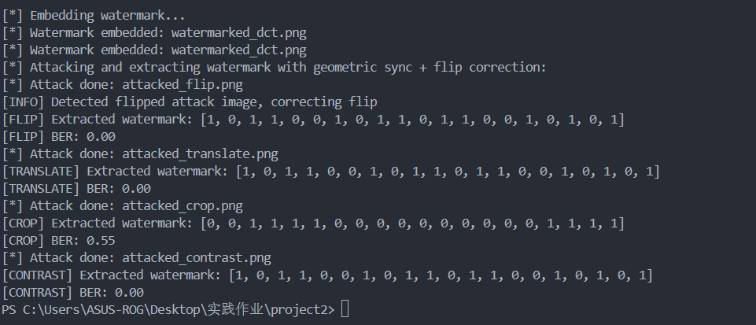

## 一、实验要求

编程实现图片水印嵌入和提取（可依托开源项目二次开发），并进行鲁棒性测试，包括不限于翻转、平移、截取、调对比度等

---

## 二、原理与技术思路

本项目实现了一种基于离散余弦变换（DCT）频域的数字水印技术，适用于彩色图像。系统不仅支持水印的嵌入与提取，还集成了几何攻击（如翻转、平移）自动检测与校正机制，有效提升水印的鲁棒性。同时，设计了多种图像攻击模拟以测试水印系统的稳健性。

### 1.离散余弦变换（DCT）

离散余弦变换（DCT）是一种将信号从空间域转换到频率域的数学工具，广泛应用于图像压缩和水印技术中。其公式如下：

对于一个二维图像块 $f(x, y)$，其二维DCT变换定义为：

$$
F(u, v) = \frac{1}{4} C(u)C(v) \sum_{x=0}^{N-1} \sum_{y=0}^{N-1} f(x, y) \cos\left[\frac{(2x+1)u\pi}{2N}\right] \cos\left[\frac{(2y+1)v\pi}{2N}\right]
$$

其中：
- $N$ 是图像块的大小（通常为 $8 \times 8$）。
- $C(u)$ 和 $C(v)$ 是归一化系数：
- 
$$
  C(u) = \begin{cases} 
  \frac{1}{\sqrt{2}}, & u = 0 \\
  1, & u > 0
  \end{cases}
$$

DCT 的逆变换（IDCT）用于将频率域信号还原到空间域，其公式为：

$$
 f(x, y) = \frac{1}{4} \sum_{u=0}^{N-1} \sum_{v=0}^{N-1} C(u)C(v) F(u, v) \cos\left[\frac{(2x+1)u\pi}{2N}\right] \cos\left[\frac{(2y+1)v\pi}{2N}\right]
$$

在本项目中，DCT 用于将图像信号从空间域转换到频率域，以便在中频系数上嵌入水印信息。中频系数的选择是因为：
- 低频系数对图像质量影响较大，不适合嵌入水印。
- 高频系数易受压缩和噪声影响，鲁棒性较差。
- 中频系数兼顾了隐蔽性和鲁棒性，是嵌入水印的理想位置。

### 2. 水印嵌入

- **颜色空间转换**：将彩色图像从BGR空间转换至YCrCb空间。水印只嵌入亮度通道（Y），因为人眼对亮度的变化较敏感，水印隐蔽性和鲁棒性更好。
- **图像分块与DCT**：将亮度通道划分为8×8像素的块，对每块进行二维DCT变换，将图像信号从空间域转换至频率域。
- **中频系数调制**：选取DCT块中一对中频系数（例如位置(4,3)）用于水印信息的调制。
  - 对应水印bit为1时，增加该系数的幅度；
  - bit为0时，减少该系数的幅度。
- **逆变换重构图像**：完成水印调制后，对每个块进行逆DCT，重构亮度通道并合成最终水印图像。

### 3. 水印提取

- **几何校正与翻转检测**：由于攻击可能导致图像发生几何变换（如翻转、旋转、平移），
  - 采用ORB特征检测和暴力匹配（BFMatcher）计算图像与原图的特征匹配程度；
  - 自动判断是否发生水平翻转，并校正翻转；
  - 利用RANSAC算法估计单应性矩阵，对攻击图像进行仿射变换以实现几何校正。
- **DCT系数差分判决**：对齐后的图像与原图进行同样的8×8块分割及DCT，
  - 对每块中频系数与原图对应系数进行差值比较，差值正负用以判定水印bit。

### 4. 鲁棒性攻击模拟

- 模拟四种攻击：
  - **水平翻转**
  - **图像平移（5像素）**
  - **中心裁剪后缩放回原大小**
  - **提高对比度**
- 通过攻击后的图像提取水印，计算误码率（BER）评估水印鲁棒性。

---

## 三、代码结构及关键模块

- `embed_watermark_dct`实现DCT域水印嵌入，调节指定系数幅度。
- `orb_match_score`计算两幅图像ORB描述子的匹配距离，用于几何相似度判断。
- `geometric_align_flip_correction`自动检测并校正翻转，同时估计单应矩阵实现几何变换对齐。
- `extract_watermark_dct_geom_sync_flip_correct`结合上述几何校正，提取水印比特序列。
- `attack_image_color`多种攻击模拟实现。
- `evaluate`
  计算提取水印与原始水印间误码率（BER）。

---

## 四、实验结果

| 攻击类型               | 误码率 (BER) | 说明                             |
| ---------------------- | ------------ | -------------------------------- |
| 翻转（flip）           | 0.00         | 成功检测并自动矫正翻转攻击       |
| 平移（translate）      | 0.00         | 几何校正有效抵抗平移攻击         |
| 裁剪（crop）           | 0.55         | 裁剪导致较大信息丢失，误码率较高 |
| 对比度调整（contrast） | 0.00         | 水印对亮度调整具有较强鲁棒性     |

---

## 五、实验结果分析

四种攻击中只有裁剪攻击（crop）误码率较高。我认为这四种攻击中裁剪是破坏性最强的攻击，因为裁剪图像后原图部分信息丢失。即使裁剪后再缩放到原尺寸，丢失了原图边缘的信息，导致部分水印块信息缺失或失真。

几何校正虽能对裁剪产生的变形做一定补偿，但无法恢复裁剪区域内丢失的信息，提取水印时错误较多，误码率明显上升。后续改进可从该方向上改进，或许使用纠错码能得到一定效果的改善。
