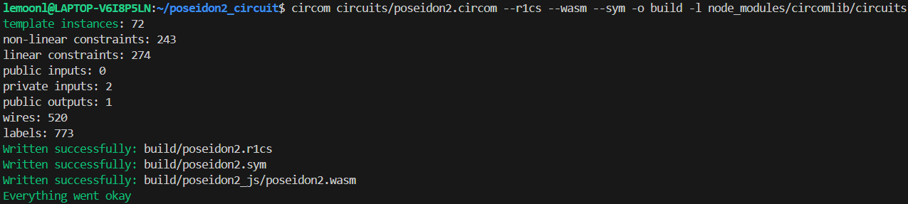
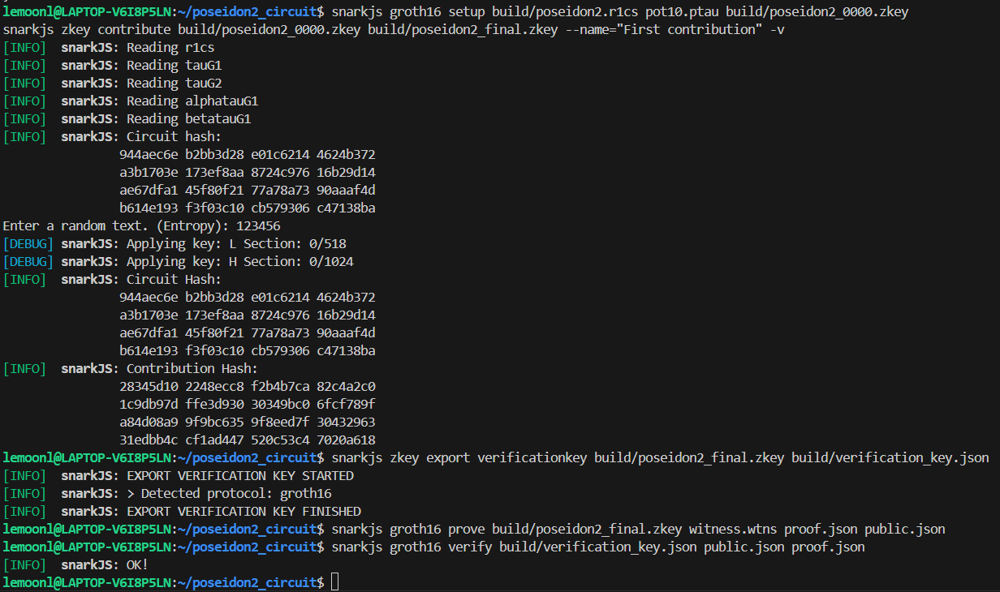
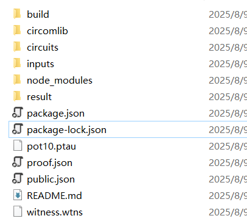

# Poseidon2 哈希电路与 Groth16 零知识证明实现


---

## 项目简介

本项目基于 Circom 2 实现了 Poseidon2 哈希算法的电路，参考论文中参数 `(n,t,d)=(256,2,5)`。  
电路接收单个区块的私有输入，计算 Poseidon2 哈希值作为公开输出。  
使用 Groth16 零知识证明方案，实现电路的证明生成与验证。  

---

## 目录结构

```
poseidon2_circuit/
├── circuits/
│   └── poseidon2.circom           # Poseidon2 哈希电路源码
├── input/
│   └── input.json                 # 隐私输入示例
├── build/
│   ├── poseidon2.r1cs             # 电路约束文件
│   ├── poseidon2_js/              # WASM 和 witness 生成代码
│   ├── poseidon2_0000.zkey        # 初始 zk-SNARK key
│   ├── poseidon2_final.zkey       # 贡献后 zk-SNARK key
│   ├── verification_key.json      # 验证密钥
├── witness.wtns                   # witness 文件
├── proof.json                    # 生成的证明
├── public.json                   # 公开输入（哈希值）
├── pot10.ptau                   # 可信设置文件
└── README.md                    # 项目说明
```

---

## 环境准备

- 操作系统：Linux/WSL  
- 依赖软件：
  - Node.js (>=18)
  - circom (2.x)
  - snarkjs (零知识证明工具)
- 安装命令：

```bash
npm install -g snarkjs
npm install circomlib
```

- 获取可信设置文件 `pot10.ptau`  

---

## 项目说明

**1. 实现 Poseidon2 哈希算法电路**  
  - 参考文档1 Table1，选择参数 (n, t, d) = (256, 3, 5) 或 (256, 2, 5)。
  - 在 `circuits/poseidon2.circom` 文件中，基于 Circom 2 语法实现 Poseidon2 哈希算法的约束逻辑。
  - 仅考虑单个 block 的哈希输入，便于电路简化和验证。

**2. 电路输入输出设计**  
  - 电路的隐私输入为哈希原象（如 a, b），即哈希函数的输入数据。
  - 电路的公开输入为 Poseidon2 哈希值（即哈希输出），用于后续证明验证。
  - 输入输出格式在 `input/input.json` 和电路文件中定义。

**3. Groth16 零知识证明生成**  
  - 使用 circom 编译电路，生成 r1cs、wasm、sym 文件。
  - 通过 `generate_witness.js` 生成 witness 文件。
  - 利用 snarkjs 工具，完成 Groth16 setup、贡献、导出验证密钥、生成证明、验证证明等全流程。
  - 相关命令和文件见下方“项目执行流程”部分。

---

## 项目执行流程

### 1. 编写电路

位于 `circuits/poseidon2.circom`，实现 Poseidon2 哈希，输入私有信号 `a`, `b`，输出公开信号 `out`。

### 2. 编译电路

```bash
circom circuits/poseidon2.circom --r1cs --wasm --sym -o build -l node_modules/circomlib/circuits
```

### 3. 准备输入

编辑 `input/input.json`：

```json
{
  "a": 3,
  "b": 11
}
```

### 4. 生成 witness

```bash
node build/poseidon2_js/generate_witness.js build/poseidon2_js/poseidon2.wasm input/input.json witness.wtns
```

### 5. zk-SNARK 可信设置及贡献

```bash
snarkjs groth16 setup build/poseidon2.r1cs pot10.ptau build/poseidon2_0000.zkey

snarkjs zkey contribute build/poseidon2_0000.zkey build/poseidon2_final.zkey --name="First contribution" -v
```

### 6. 导出验证密钥

```bash
snarkjs zkey export verificationkey build/poseidon2_final.zkey build/verification_key.json
```

### 7. 生成零知识证明

```bash
snarkjs groth16 prove build/poseidon2_final.zkey witness.wtns proof.json public.json
```

### 8. 验证证明

```bash
snarkjs groth16 verify build/verification_key.json public.json proof.json
```

---

## 结果展示
输出如下图则说明运行成功





若运行失败请检查环境配置及运行代码，实际运行目录如下



---
