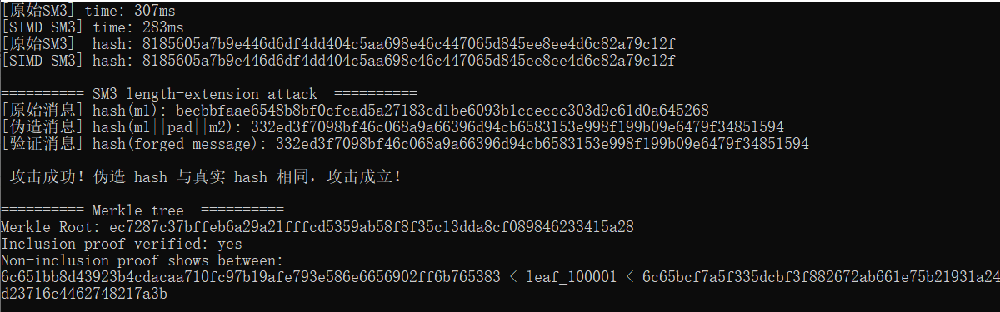

# SM3的软件实现与优化 

## 实验目的
1. 测试原始 SM3 算法与 SIMD 优化版本的性能差异。
2. 验证 SM3 长度扩展攻击的可行性。
3. 构建 Merkle 树并验证其存在性和不存在性证明。


## 实验内容

### 1. SM3 算法性能测试

#### SM3 算法介绍
SM3 是中国国家密码管理局发布的密码杂凑算法，广泛应用于数字签名、消息认证等领域。其核心结构类似于 SHA-256，采用 Merkle-Damgård 结构，分组长度为 512 位，输出长度为 256 位。

1. **消息填充**
   对消息 $m$ 进行填充，使其长度满足 $L + 1 + K \equiv 448 \ (\text{mod} \ 512)$，其中 $L$ 为消息长度， $K$ 为填充的 0 的个数。
   
$$
m' = m || 1 || 0^K || \text{len}(m)
$$

3. **消息扩展**
   将填充后的消息分为 $n$ 个 512 位分组 $B_1, B_2, \dots, B_n$，对每个分组进行消息扩展，生成 132 个 32 位字：
   
$$
   W_j = \begin{cases} 
   B_j & 0 \leq j < 16 \\
   P_1(W_{j-16} \oplus W_{j-9} \oplus (W_{j-3} \lll 15)) \oplus (W_{j-13} \lll 7) \oplus W_{j-6} & 16 \leq j < 68 \\
   W_{j-68} \oplus W_{j-64} & 68 \leq j < 132
   \end{cases}
$$

5. **压缩函数**
   使用布尔函数 $FF$ 和 $GG$，以及置换函数 $P_0$ 和 $P_1$，对每个分组进行迭代压缩：
   
$$V_i = CF(V_{i-1}, B_i)$$

 其中  $CF$ 表示压缩函数， $V_i$ 为中间哈希值。

7. **输出结果**
   最终输出 $V_n$ 作为消息的哈希值。

#### 实验测试代码
```cpp
// 原始 SM3 算法
SM3 sm3;
sm3.update(reinterpret_cast<const uint8_t*>(message.data()), message.size());
auto result1 = sm3.digest();

// SIMD 优化的 SM3 算法
SM3_SIMD sm3simd;
sm3simd.update(reinterpret_cast<const uint8_t*>(message.data()), message.size());
auto result2 = sm3simd.digest();
```

#### 实验结果


- **原始 SM3**: 307ms
- **SIMD SM3**: 283ms

#### 分析
SIMD 优化版本利用了 CPU 的并行计算能力，相较于原始版本，性能提升约 7.8%。

### 2. SM3 长度扩展攻击

#### 实验代码
```cpp
// 构造伪造消息 m1 || pad(m1) || m2
std::vector<uint8_t> forged_message(m1.begin(), m1.end());
std::vector<uint8_t> pad = sm3_padding(m1.size());
forged_message.insert(forged_message.end(), pad.begin(), pad.end());
forged_message.insert(forged_message.end(), m2.begin(), m2.end());

// 设置 IV 为 h1，继续 hash(m2)
SM3 attacker;
attacker.setIV(iv);
attacker.setTotalLen(m1.size() + pad.size());
attacker.update(reinterpret_cast<const uint8_t*>(m2.data()), m2.size());
std::vector<uint8_t> forged_hash = attacker.digest();
```

#### 实验结果
- **原始消息 hash(m1)**: `becbbfaae6548b8bf0cfcad5a27183cd1be6093b1cceccc303d9c61d0a645268`
- **伪造消息 hash(m1||pad||m2)**: `332ed3f7098bf46c068a9a66396d94cb6583153e998f199b09e6479f34851594`
- **验证消息 hash(forged_message)**: `332ed3f7098bf46c068a9a66396d94cb6583153e998f199b09e6479f34851594`

#### 攻击过程
1. **SM3 消息填充**:
   对消息 $m$ 进行填充，使其长度满足 $L + 1 + K \equiv 448 \ (\text{mod} \ 512)$，其中 $L$ 为消息长度， $K$ 为填充的 0 的个数。

$$
m' = m || 1 || 0^K || \text{len}(m)
$$

3. **长度扩展攻击**:
   假设攻击者已知 $\text{hash}(m_1)$ 和 $\text{len}(m_1)$，可以构造伪造消息：
   
$$
m_1 || \text{pad}(m_1) || m_2
$$

   并通过设置初始向量为 $\text{hash}(m_1)$，计算伪造消息的哈希值。

#### 分析
实验结果表明，伪造消息的哈希值与真实哈希值一致，证明 SM3 存在长度扩展攻击的风险。

### 3. Merkle 树构建与验证

#### Merkle 树简介

Merkle 树是一种树形数据结构，广泛应用于区块链和数据完整性验证中。其核心思想是通过哈希值递归计算生成树的根节点（Merkle 根），从而高效验证数据的完整性和一致性。

#### Merkle 树的构建
1. **叶子节点**：
   每个叶子节点存储数据块的哈希值：
   
$$
H_i = \text{Hash}(D_i)
$$

   其中 $D_i$ 表示第 $i$ 个数据块。

3. **内部节点**：
   每个内部节点存储其子节点哈希值的组合哈希：
   
$$
H_{\text{parent}} = \text{Hash}(H_{\text{left}} || H_{\text{right}})
$$

   其中 $H_{\text{left}}$ 和 $H_{\text{right}}$ 分别是左子节点和右子节点的哈希值。

3. **根节点**：
   最终生成的根节点（Merkle 根）代表整个数据集的哈希值。

#### 存在性证明
存在性证明用于验证某个数据块是否属于 Merkle 树。
1. **证明路径**：
   对于目标数据块 $D_i$，从叶子节点到根节点，记录每一层的兄弟节点哈希值:
   Proof = {H_sib1, H_sib2, ..., H_sibk}

3. **验证过程**：
   从目标数据块的哈希值 $H_i$ 开始，依次与证明路径中的哈希值组合计算，直到得到 Merkle 根:
   H_root = Hash(...Hash(Hash(H_i || H_sib1) || H_sib2)...)
#### 不存在性证明
不存在性证明用于验证某个数据块不属于 Merkle 树。
1. **区间查找**：
   找到目标数据块在排序后的叶子节点中的位置区间：
   
$$
H_{\text{left}} < \text{Hash}(D_{\text{target}}) < H_{\text{right}}
$$

   其中 $H_{\text{left}}$ 和 $H_{\text{right}}$ 分别是目标数据块的前后相邻节点的哈希值。

3. **验证过程**：
   验证  $H_{\text{left}}$  和  $H_{\text{right}}$  是否在 Merkle 树中，并检查其路径是否正确。

通过上述过程，Merkle 树能够高效地完成数据的存在性和不存在性验证，适用于大规模数据完整性校验场景。

#### 实验测试代码
```cpp
// 构建 Merkle 树
MerkleTree tree(leaves);
auto root = tree.getRoot();

// 存在性证明
size_t targetIndex = 12345;
auto proof = tree.getInclusionProof(targetIndex);
bool verified = tree.verifyInclusionProof(leaves[targetIndex], targetIndex, proof, root);

// 不存在性证明
std::string fakeLeaf = "leaf_100001";
std::vector<uint8_t> left, right;
tree.getNonInclusionProof(fakeLeaf, left, right);
```

#### 实验结果
- **Merkle 根**: `ec7287c37bffeb6a29a21fffcd5359ab58f8f35c13dda8cf089846233415a28`
- **存在性证明验证**: `yes`
- **不存在性证明区间**: `6c651bb8d43923b4cdacaa710fc97b19afe793e586e6656902ff6b765383 < leaf_100001 < 6c65bcf7a5f335dcbf3f882672ab661e75b21931a24d23716c4462748217a3b`

#### 分析
Merkle 树通过哈希值构建树结构，能够高效验证数据的存在性和不存在性，适用于区块链等场景。

## 实验总结
1. SIMD 优化提升了 SM3 约 7.8%的计算性能。
2. SM3 存在长度扩展攻击的风险，应避免直接使用哈希值作为认证信息。
3. Merkle 树在数据完整性验证中具有重要应用价值。
