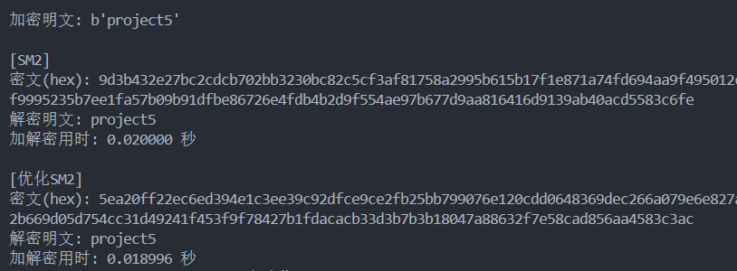
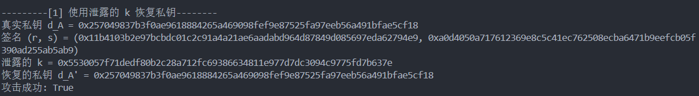
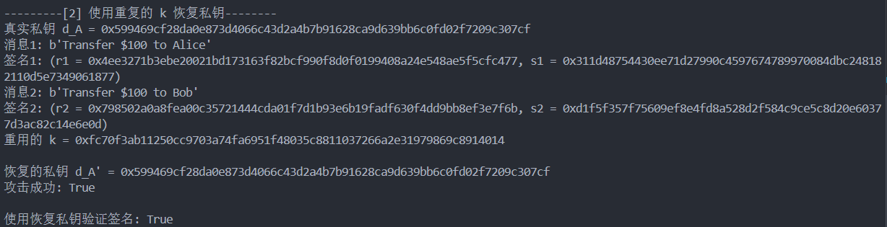
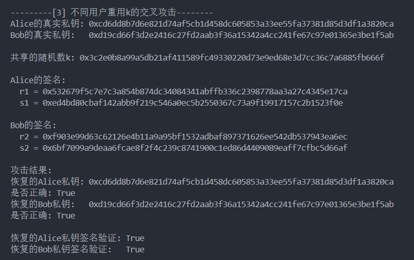
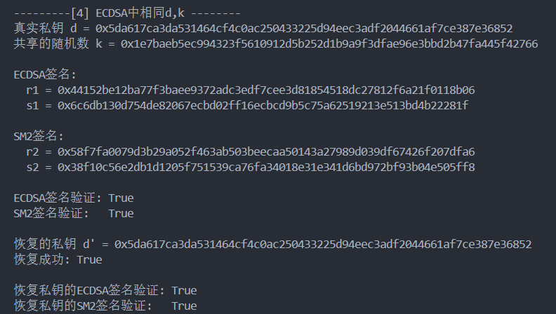
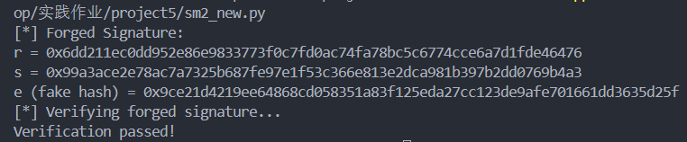

# SM2算法实验报告

## 项目结构说明

本项目包含如下主要文件：

- `main.py`：主程序入口，可用于调用各模块进行功能测试或综合演示。
- `sm2.py`：基础版SM2算法实现，包含加解密、签名等基本功能。
- `sm2_optimized.py`：基于Montgomery阶梯法优化的SM2实现，关注标量乘法效率。
- `sm2_window_opt.py`：基于窗口法优化的SM2实现，进一步提升标量乘法效率。
- `sm2_new.py`：为配合攻击POC而改进的SM2签名实现，便于演示私钥恢复等攻击。实现了伪造中本聪的签名。
- `sm2_signature_poc.py`：包含SM2签名安全性相关的四种攻击POC及相关辅助代码。

各文件功能分明，便于分别测试SM2的基础实现、优化效果及安全性分析。

## 一、SM2算法简介

SM2是中国国家密码管理局发布的基于椭圆曲线密码学（ECC）的公钥密码算法标准，广泛应用于数字签名、密钥交换和公钥加密等场景。SM2算法的安全性基于椭圆曲线离散对数问题（ECDLP）。

### 1.1 椭圆曲线参数
SM2推荐曲线参数如下：
- 椭圆曲线方程：
  
$$
  E: y^2 = x^3 + ax + b \pmod{p}
$$
- 参数：
  - $p$、 $a$、 $b$：曲线参数
  - $G=(x_G, y_G)$：基点
  - $n$：基点的阶

### 1.2 密钥生成
- 私钥 $d \in_R [1, n-1]$
- 公钥 $P = dG$

### 1.3 加密流程
1. 随机选取 $k \in_R [1, n-1]$
2. 计算 $C_1 = kG$
3. 计算 $S = kP$，记 $S=(x_2, y_2)$
4. 计算密钥派生值 $t = KDF(x_2 || y_2, klen)$
5. 计算 $C_2 = M \oplus t$
6. 计算 $C_3 = Hash(x_2 || M || y_2)$
7. 输出密文 $C = (C_1, C_2, C_3)$

### 1.4 解密流程
1. 解析 $C_1$，计算 $S' = dC_1 = (x_2, y_2)$
2. 计算 $t = KDF(x_2 || y_2, klen)$
3. 还原明文 $M = C_2 \oplus t$
4. 验证 $C_3 = Hash(x_2 || M || y_2)$

## 二、SM2的优化方法

### 2.1 Montgomery阶梯法（sm2_optimized.py）

#### 原理
Montgomery阶梯法是一种安全且高效的椭圆曲线标量乘法算法，具有无条件分支的特点，可抵抗侧信道攻击。

#### 数学描述
给定点 $P$ 和标量 $k$ ，其二进制为 $k = (k_{n-1}, ..., k_0)$ ，算法维护两个点 $R_0$ 和 $R_1$ ：
- 初始化： $R_0 = \mathcal{O}$ (无穷点)， $R_1 = P$
- 对每一位 $k_i$ ：
  - 若 $k_i=0$，则 $R_1 = R_0 + R_1, R_0 = 2R_0$
  - 若 $k_i=1$，则 $R_0 = R_0 + R_1, R_1 = 2R_1$
- 最终 $R_0$ 即为 $kP$

### 优化结果分析
经测试该优化方法反而进行了负优化，加解密时间更长了。原因可能是：

1. **Python实现的效率问题**：Montgomery阶梯法理论上可提升安全性和一定的效率，但其优势主要体现在硬件或低层高效实现（如C/C++），而Python本身的运算和对象操作开销较大，导致算法本身的分支优势被解释器的低效抵消。
2. **循环次数增加**：Montgomery阶梯法每处理一位都要进行两次点加/倍点操作（R0和R1都要更新），而普通“左到右”算法在遇到0时只做倍点，遇到1时才做加法和倍点，实际操作次数可能更少。
3. **ecdsa库的Point对象加法和倍点实现未做底层优化**：sm2_optimized.py中所有点加、倍点操作都依赖ecdsa库的高层Point对象，未利用底层数值运算优化，导致每次加法/倍点都涉及大量Python对象操作和内存分配。
4. **未利用预计算**：Montgomery阶梯法本身不涉及预计算，而原始实现可通过窗口法等方式减少实际点加法次数。
5. **无条件分支带来的额外操作**：虽然无条件分支提升了抗侧信道攻击能力，但在纯软件环境下会带来额外的无用计算，影响整体效率。

Montgomery阶梯法更适合对抗侧信道攻击的高安全场景或硬件实现，在Python等高级语言下反而可能因实现细节导致效率下降。

### 2.2 窗口法（sm2_window_opt.py）

#### 原理
窗口法通过预计算 $G, 2G, ..., (2^w-1)G$ ，将标量 $k$ 分组处理，减少点加法次数，提高标量乘法效率。

#### 数学描述
- **初始化**：生成私钥和公钥，并预计算窗口内的点。
- **预计算窗口点**：使用窗口法预计算 $G, 2G, ..., (2^w - 1)G$，其中 $w$ 是窗口大小。
- **窗口标量乘法**：使用预计算的点进行快速标量乘法。
- **加密**：生成随机数 $k$，计算 $C_1 = kG$ 和 $S = kQ$，然后使用 $S$ 的哈希值 $t$ 对消息进行异或加密，生成 $C_2$，并计算消息认证码 $C_3$。
- **解密**：使用私钥计算 $S$，然后使用 $S$ 的哈希值 $t$ 对密文进行异或解密，并验证消息认证码 $C_3$。

### 优化结果分析
窗口法优化的实验结果见下图：

从图中可以看出，窗口法在加解密效率上相较于未优化实现有一定提升，尤其是在大消息量或多次加解密场景下更为明显。其主要原因在于通过预计算和分组处理，减少了椭圆曲线点加法的次数，提高了整体标量乘法的执行效率。但在窗口大小设置过大时，预计算和内存消耗也会增加，需根据实际场景权衡选择。

## 三、四种攻击POC及sm2_new

为演示SM2签名的安全性问题，`sm2_new.py`对原SM2签名流程做了适配，便于实现如下四种攻击：

### 3.1 泄露k恢复私钥

若签名时的随机数$k$被泄露，则可通过如下公式恢复私钥：

$$
d_A = (s + r)^{-1} \cdot (k - s) \bmod n
$$

#### 推导过程：
在签名过程中，我们有：

$$
s = ((1 + d_A)^{-1} \cdot (k - r \cdot d_A)) \bmod n
$$

将等式两边乘以 $(1 + d_A)$ 得到：

$$
s(1 + d_A) = k - r \cdot d_A \bmod n
$$

展开并整理得到：

$$
s + s \cdot d_A = k - r \cdot d_A \bmod n
$$

$$
s + r \cdot d_A + s \cdot d_A = k \bmod n
$$

提取 $d_A$：

$$
(s + r) \cdot d_A = k - s \bmod n
$$

最后，解出 $d_A$：

$$
d_A = (s + r)^{-1} \cdot (k - s) \bmod n
$$

### 测试结果

### 3.2 重用k恢复私钥（同一用户）

同一用户对不同消息重用 $k$，可通过两组签名 $(r_1, s_1), (r_2, s_2)$ 恢复私钥：

$$
d_A = \frac{s_2 - s_1}{s_1 - s_2 + r_1 - r_2} \bmod n
$$

#### 推导过程：
在签名过程中，我们有：

$$
s_1 = ((1 + d_A)^{-1} \cdot (k - r_1 \cdot d_A)) \bmod n
$$

$$
s_2 = ((1 + d_A)^{-1} \cdot (k - r_2 \cdot d_A)) \bmod n
$$

将等式两边乘以 $(1 + d_A)$ 得到：

$$
s_1(1 + d_A) = k - r_1 \cdot d_A \bmod n
$$

$$
s_2(1 + d_A) = k - r_2 \cdot d_A \bmod n
$$

约掉k得到：

$$
(s_1-s_2)( 1 + d_A )=(r_2 - r_1) d_A \bmod n
$$

展开解出 $d_A$ ：

$$
d_A = (s_2 - s_1) \cdot (s_1 - s_2 + r_1 - r_2)^{-1} \bmod n
$$

### 测试结果

### 3.3 不同用户重用k的交叉攻击

若不同用户签名时重用 $k$ ，可互相恢复对方私钥： 

$$
d_A = \frac{k - s_1}{s_1 + r_1} \bmod n
$$

$$
d_B = \frac{k - s_2}{s_2 + r_2} \bmod n
$$

#### 推导过程：
已知 Alice 签名 $(r_1, s_1)$ 和 Bob 签名 $(r_2, s_2)$ ，我们有：  

$$
s_1 = ((1 + d_A)^{-1} \cdot (k - r_1 \cdot d_A)) \bmod n
$$

$$
s_2 = ((1 + d_B)^{-1} \cdot (k - r_2 \cdot d_B)) \bmod n
$$

将等式两边乘以 $(1 + d_A)$ 和 $(1 + d_B)$ 得到：

$$
s_1(1 + d_A) = k - r_1 \cdot d_A \bmod n
$$

$$
s_2(1 + d_B) = k - r_2 \cdot d_B \bmod n
$$

展开并整理得到：

$$
s_1 + s_1 \cdot d_A = k - r_1 \cdot d_A \bmod n
$$

$$
s_2 + s_2 \cdot d_B = k - r_2 \cdot d_B \bmod n
$$

将所有包含 $d_A$ 和 $d_B$ 的项移到一边：

$$
(s_1 + r_1) \cdot d_A = k - s_1 \bmod n
$$

$$
(s_2 + r_2) \cdot d_B = k - s_2 \bmod n
$$

最后，解出 $d_A$ 和 $d_B$ ： 

$$
d_A = (s_1 + r_1)^{-1} \cdot (k - s_1) \bmod n
$$

$$
d_B = (s_2 + r_2)^{-1} \cdot (k - s_2) \bmod n
$$

### 测试结果

### 3.4 ECDSA与SM2同d,k攻击

若同一私钥和随机数 $k$ 被用于ECDSA和SM2签名，可通过两组签名恢复私钥：

$$
d = \frac{s_1 \cdot s_2 - e_1} {r_1 - s_1 \cdot s_2 - s_1 \cdot r_2}\bmod n
$$

#### ECDSA签名流程
- 随机选取整数  $k$，满足：  $1 \leq k \leq n - 1$ 
- 计算曲线点：

$$
R = kG = (x, y)
$$

- 计算消息哈希：
   
$$
e_1 = \text{hash}(m)
$$

- 计算签名分量：
   
$$
r_1 = x \bmod n 
$$

$$
s_1 = (e_1 + r_1d)k^{-1} \bmod n
$$

- 签名结果： $(r_1, s_1)$

#### 推导过程：
已知 ECDSA 签名 $(r_1, s_1)$ 和 SM2 签名 $(r_2, s_2)$，我们有：

$$
s_1 = (e_1 + r_1 \cdot d) \cdot k^{-1} \bmod n
$$

$$
s_2 = (1 + d)^{-1} \cdot (k - r_2 \cdot d) \bmod n
$$

将等式两边乘以 $k$ 和 $(1 + d)$ 得到：

$$
s_1 \cdot k = e_1 + r_1 \cdot d \bmod n
$$

$$
s_2 \cdot (1 + d) = k - r_2 \cdot d \bmod n
$$

整理得到：

$$
k = \frac{e_1 + r_1 \cdot d }{s_1}\bmod n
$$

$$
k = s_2 + r_2 \cdot d + s_2 \cdot d \bmod n
$$

约掉k，并整理：

$$
\frac{e_1 + r_1 \cdot d }{s_1} = s_2 + r_2 \cdot d + s_2 \cdot d\bmod n
$$

$$
d \cdot (r_1 - s_1 \cdot s_2 - s_1 \cdot r_2) = s_1 \cdot s_2 - e_1  \bmod n
$$

最后，解出 $d$ ：

$$
d = \frac{s_1 \cdot s_2 - e_1} {r_1 - s_1 \cdot s_2 - s_1 \cdot r_2}\bmod n
$$

### 测试结果

## 四、伪造中本聪的数字签名

在sm2_new.py中新添了中本聪的数字签名伪造

### ECDSA伪造签名过程分析

在未校验签名消息内容的情况下，ECDSA存在可被伪造的安全隐患。具体过程如下：

- **密钥生成：**

$$P = dG$$

  其中 $n$ 为基点 $G$ 的阶。

- **签名 $Sign(m)$：**
  1. 随机选取 $k \in \mathbb{Z}_n^*$ ，计算 $R = kG$
  2. $r = R_x \bmod n,\ r \neq 0$
  3. $e = \text{hash}(m)$
  4. $s = k^{-1}(e + dr) \bmod n$
  5. 签名为 $(r, s)$

- **验证 $(r, s)$ 是否为 $m$ 的有效签名：**
  1. $e = \text{hash}(m)$
  2. $w = s^{-1} \bmod n$
  3. $R' = e \cdot wG + r \cdot wP$
  4. 检查 $r' = x' \bmod n$ 是否等于 $r$

  验证成立的推导：

$$
es^{-1}G + rs^{-1}P = s^{-1}(eG + rP) = k(e + dr)^{-1}(e + dr)G = kG = R
$$

### 伪造签名过程
  若验证仅依赖消息哈希值，则攻击者可如下伪造签名：
  1. 任取 $u, v \in \mathbb{F}_n^*$
  2. 计算 $R' = uG + vP = (x', y')$
  3. 令 $r' = x' \bmod n$
  4. 构造 $e', s'$ 满足：
     - $s'^{-1}e' = u \Rightarrow e' = r'u(s')^{-1} \bmod n$
     - $s'^{-1}r' = v \Rightarrow s' = r'v^{-1} \bmod n$
  5. 则 $\sigma' = (r', s')$ 是 $e'$ 的有效签名

### 测试结果

---

