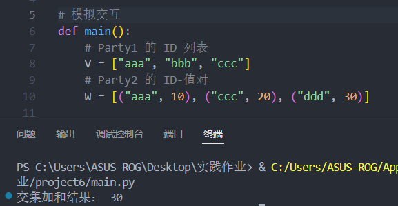

# 基于DDH的私密交集求和协议

## 实验目的

本实验旨在实现基于DDH假设的私密交集求和协议，验证其在保护数据隐私的同时，能够正确计算交集和的功能。通过实验，理解同态加密和随机预言机的应用。

## 项目构成

本项目包含以下主要文件：

- **main.py**: 实现协议的主程序，负责模拟 Party1 和 Party2 的交互过程。
- **crypto_utils.py**: 提供加法同态加密（AHE）相关的工具函数。
- **party1.py**: 定义 Party1 的行为，包括 Round 1 和 Round 3 的处理逻辑。
- **party2.py**: 定义 Party2 的行为，包括 Round 2 的处理逻辑。

通过这些文件的协作，完整实现了基于 DDH 的私密交集求和协议。

## 输入

- **双方**: 一个素数阶群 $G$ 和一个标识符空间 $U$。一个哈希函数 $H : U \rightarrow G$，被建模为随机预言机，将标识符映射到 $G$ 的随机元素。
- **$P_1$**: 集合 $V = \{v_i\}_{i=1}^{m_1}$ ，其中 $v_i \in U$
- **$P_2$**: 键值对集合 $W = \{(w_i, t_i)\}_{i=1}^{m_2}$ ，其中 $w_i \in U$， $t_i \in \mathbb{Z}^+$

## 设置

- 每个 $P_i$ 选择一个随机私有指数 $k_i$ 属于群 $G$
- $P_2$ 为加法同态加密方案生成一个新的密钥对 $(pk, sk) \leftarrow \text{AGen}(\lambda)$ ，并将公钥 $pk$ 发送给 $P_1$

## 协议流程

### 第1轮 ($P_1$):

1. 对于其集合中的每个元素 $v_i$ , $P_1$ 应用哈希函数并使用其密钥 $k_1$ 进行指数运算，从而计算 $H(v_i)^{k_1}$
2. $P_1$ 将 $\{H(v_i)^{k_1}\}_{i=1}^{m_1}$ 以随机顺序发送给 $P_2$

### 第2轮 ($P_2$):

1. 对于从 $P_1$ 接收到的每个元素 $H(v_i)^{k_1}$，$P_2$ 使用其密钥 $k_2$ 进行指数运算，计算 $H(v_i)^{k_1 k_2}$。
2. $P_2$ 将 $Z = \{H(v_i)^{k_1 k_2}\}_{i=1}^{m_1}$ 以随机顺序发送给 $P_1$。
3. 对于其输入集合中的每个项 $(w_j, t_j)$，$P_2$ 对键值对的第一个元素应用哈希函数并使用密钥 $k_2$ 进行指数运算。然后使用加法同态加密密钥 $pk$ 加密键值对的第二个元素，从而计算对 $(H(w_j)^{k_2}, \text{AEnc}(t_j))$。
4. $P_2$ 将集合 $\{(H(w_j)^{k_2}, \text{AEnc}(t_j))\}_{j=1}^{m_2}$ 以随机顺序发送给 $P_1$。

### 第3轮 ($P_1$):

1. 对于从 $P_2$ 在第2轮步骤4中接收到的每个项 $(H(w_j)^{k_2}, \text{AEnc}(t_j))$，$P_1$ 使用 $k_1$ 对对的第一个成员进行指数运算，从而计算 $(H(w_j)^{k_1 k_2}, \text{AEnc}(t_j))$。
2. $P_1$ 计算交集集合 $J$ :

$$
J = \{j : H(w_j)^{k_1 k_2} \in Z\}
$$

   其中 $Z$ 是从 $P_1$ 在第1轮接收到的集合。

3. 对交集中所有项，$P_1$ 同态地将相关密文相加，并计算加密的交集和 $S_J$ ：

$$
\text{AEnc}(pk, S_J) = \text{ASum}(\{\text{AEnc}(t_j)\}_{j \in J}) = \text{AEnc}\left(\sum_{j \in J} t_j\right)
$$

   $P_1$ 然后使用 $\text{ARefresh}$ 随机化密文并将其发送给 $P_2$

## 输出 ($P_2$)

$P_2$ 使用密钥 $sk$ 解密在第3轮接收到的密文以恢复交集和 $S_J$

## 测试例子

在实验中，我们使用以下测试数据进行验证：

- **Party1 的 ID 列表**: `["aaa", "bbb", "ccc"]`
- **Party2 的 ID-值对**: `[("aaa", 10), ("ccc", 20), ("ddd", 30)]`

通过运行代码，我们得到了交集加和结果为 `30`，如以下截图所示：

## 结果分析

通过实验，我们验证了协议的正确性和有效性：

1. 交集和的计算结果与预期一致，证明了协议的功能正确性。
2. 协议在保护双方输入数据隐私的同时，能够有效地计算交集和，体现了其隐私保护能力。
3. 实验过程中，计算的时间和资源消耗在可接受范围内，表明协议具有较好的效率。

实验结果表明，该协议在隐私保护和计算效率之间达到了良好的平衡，适合在需要保护数据隐私的场景中应用。
